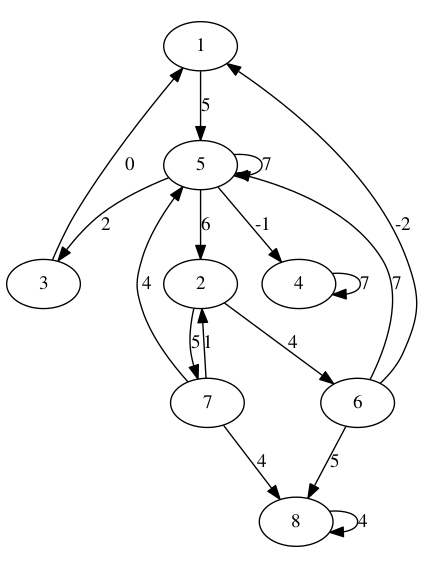

# Lab4 实验报告

> PB15000102 王嵩超

## 实验内容

- 实现求有向图的强连通分量的算法
- 实现求所有点对最短路径的Johnson算法


##实验要求

- 两个实验内均有5次运行过程，每次运行过程所用到的图的顶点数N均分别为8、16、32、64,  128、256，弧的数目为$N *log(N)$。
- 第二个实验中，边的权重也是随机生成，其中有$log(N)$条边的权重为负。负边权的取值范围为-N到N，正边权的取值范围为0到N。

>   <span style="color:red">本实验中第二个实验的原要求有不严谨之处：<span>
>
>   在无向图中，若存在负权重边，则Johnson算法所调用的Bellman-Ford算法会发现在此负权重边的两点之间反复行走，可以得到负权重环，从而停止，得不出`h(v)`。
>
>   即使通过某种修改的办法，用类似的算法得出了`h(v)`，对该负向边的边权进行改变时，由于修正量`h(u)-h(v)`和`h(v)-h(u)`不可能全为正，修正后的`w*(u,v)`和`w*(v,u)`不可能均为正，即仍存在负向边。此问题的根源是出现了负权重环。
>
>   故在本实验中我使用了有向图，与课本的算法是一致的。

## 实验环境

| Key  | Value        |
| ---- | ------------ |
| 机器内存 | 16           |
| 时钟主频 | 2.60 GHz     |
| 编译环境 | Ubuntu 17.10 |


## 程序构建方法

在根目录下有`Makefile`。用Linux命令行在该目录下执行：

```bash
make project1
make project2
```

即可完成构建。

## 程序介绍

程序使用C++编写，代码已在[github](https://github.com/songchaow/Algorithm-Labs)开源。

本次程序的特色：

- 代码的高可复用性

  两个project的很多数据结构都是可共用的，比如图的节点和边。故我使部分代码在两个project间共享，如把由project1的`graph.cpp`生成的`graph.o`加到project2的链接项中。详见`Makefile`。

- 图形化输出

  程序使用了开源的`graphviz`工具。在图创建完成后会输出`graphviz`所支持的`DOT`语言，并用`system()`调用`graphviz`输出PDF格式的图表示。详见`main.cpp`的`serializer`函数。

下面简述两个project的程序设计：

两个project包含三个C++源文件：`main.cpp`, `graph.cpp`, `graph.h`。

其中`graph.h`存放类的定义，`graph.cpp`存放类的实现，`main.cpp`存放入口函数与测试例程。

### project 1

`DirectedGraph`类是有向图的表示，而`GNode`和`ENode`分别是节点和边的类型。`DirectedGraph`类的成员`pointlist`是一个包含`GNode`的vector。

此外还有`DFSTool`类，用来提供深度优先搜索的功能以及存放搜索结果。为了增强灵活性，我没有把搜索的结果以及各节点的状态，如颜色等信息，存入`DirectedGraph`的成员中，而是存入了`DFSTool`的成员`DFSResult`中。`DFSResult`是一个`map`对象，能将`GNode*`类型匹配到`DFSData`结构体，而该结构体存储了颜色、父节点等遍历信息。

`run()`函数是会被执行多次的运行过程。

### project 2

project2继承了project1的多个类和结构体。如`WGNode`和`WENode`分别继承自`GNode`和`ENode`，添加了权重字段。同时`WeightedDirectedGraph`类继承自`DirectedGraph`类，重写了`addNode`和`addEdge`成员函数，以使添加的节点和边是继承的类型而非基类。

project2增加了`ShortestPathTool`，用来提供两个单源最短路径算法和Johnson算法。

同时，`pointlist`改用`std::list`实现，这是由于考虑到之后计算中需要对图进行改动(如添加一个节点`s`，以及添加多条权重为0的边)，其中添加`WGNode`的操作可能会使已存在的`WGNode`的地址发生变化(因为`vector`是变长数组，这种变化是允许的）。这样的地址变化会使`map`类型的用于存储距离记录的`record_map`对象失效，因为它的关键字还是原来的地址。而`std::list`就不会有这种问题。

## 运行结果分析

### project 1

**结果分析**

运行结果位于project的output文件夹。下面对多次运行中的N=128的规模进行抽样分析：

此规模具有128个节点和数百个边，得到的强连通分量有9个。观察发现，无论是此次运行还是其他规模的运行结果，绝大部分节点都位于一个强连通分量，而少部分节点分散地位于其他几个强连通分量。这种结果的出现是可以用概率解释的：若生成的边的数量足够多后，再次生成的边有更大概率会与之前的边所关联到的节点联系在一起，从而属于同一个强连通分量。

**时间分析**

在每次运行中，要求统计的是各联通分量的求解时间，事实上，其中最大的连通分量求解时长占据总时长的大部分。

而6次不同规模的运行时间分别为：

| Scale(n) | Time      |
| -------- | --------- |
| 8        | 7160ns    |
| 16       | 35718ns   |
| 32       | 61355ns   |
| 64       | 147680ns  |
| 128      | 361764ns  |
| 256      | 1047520ns |

**时间曲线**


可发现时间复杂度比规模n增长稍快(即在n翻倍时，时间比翻倍还要增加一点)，符合深度优先搜索时间复杂度O(E)的特征(本实验中E为nlg(n))。

### project 2

**结果分析**

运行结果位于project的output文件夹。由于所有点对间的最短路径输出结果数据量较大，下面仅以n=8时的结果为例分析：

```reStructuredText
Shortest path from node 1
	node 2 : 2<- 5<- 1
		 Length: 11
	node 3 : 3<- 5<- 1
		 Length: 7
	node 4 : 4<- 5<- 1
		 Length: 4
	node 5 : 5<- 1
		 Length: 5
	node 6 : 6<- 2<- 5<- 1
		 Length: 15
	node 7 : 7<- 2<- 5<- 1
		 Length: 16
	node 8 : 8<- 6<- 2<- 5<- 1
		 Length: 20
Shortest path from node 2
	node 1 : 1<- 6<- 2
		 Length: 2
	node 3 : 3<- 5<- 1<- 6<- 2
		 Length: 9
	node 4 : 4<- 5<- 1<- 6<- 2
		 Length: 6
	node 5 : 5<- 1<- 6<- 2
		 Length: 7
	node 6 : 6<- 2
		 Length: 4
	node 7 : 7<- 2
		 Length: 5
	node 8 : 8<- 6<- 2
		 Length: 9
Shortest path from node 3
	node 1 : 1<- 3
		 Length: 0
	node 2 : 2<- 5<- 1<- 3
		 Length: 11
	node 4 : 4<- 5<- 1<- 3
		 Length: 4
	node 5 : 5<- 1<- 3
		 Length: 5
	node 6 : 6<- 2<- 5<- 1<- 3
		 Length: 15
	node 7 : 7<- 2<- 5<- 1<- 3
		 Length: 16
	node 8 : 8<- 6<- 2<- 5<- 1<- 3
		 Length: 20
Shortest path from node 4
	node 1 : No route to this point!
	node 2 : No route to this point!
	node 3 : No route to this point!
	node 5 : No route to this point!
	node 6 : No route to this point!
	node 7 : No route to this point!
	node 8 : No route to this point!
Shortest path from node 5
	node 1 : 1<- 3<- 5
		 Length: 2
	node 2 : 2<- 5
		 Length: 6
	node 3 : 3<- 5
		 Length: 2
	node 4 : 4<- 5
		 Length: -1
	node 6 : 6<- 2<- 5
		 Length: 10
	node 7 : 7<- 2<- 5
		 Length: 11
	node 8 : 8<- 6<- 2<- 5
		 Length: 15
Shortest path from node 6
	node 1 : 1<- 6
		 Length: -2
	node 2 : 2<- 5<- 1<- 6
		 Length: 9
	node 3 : 3<- 5<- 1<- 6
		 Length: 5
	node 4 : 4<- 5<- 1<- 6
		 Length: 2
	node 5 : 5<- 1<- 6
		 Length: 3
	node 7 : 7<- 2<- 5<- 1<- 6
		 Length: 14
	node 8 : 8<- 6
		 Length: 5
Shortest path from node 7
	node 1 : 1<- 6<- 2<- 7
		 Length: 3
	node 2 : 2<- 7
		 Length: 1
	node 3 : 3<- 5<- 7
		 Length: 6
	node 4 : 4<- 5<- 7
		 Length: 3
	node 5 : 5<- 7
		 Length: 4
	node 6 : 6<- 2<- 7
		 Length: 5
	node 8 : 8<- 7
		 Length: 4
Shortest path from node 8
	node 1 : No route to this point!
	node 2 : No route to this point!
	node 3 : No route to this point!
	node 4 : No route to this point!
	node 5 : No route to this point!
	node 6 : No route to this point!
	node 7 : No route to this point!
```

而对应的图为(source目录下的`graph8_origin.pdf`)：




可以与结果直观的对照。

**时间分析**

| Scale(n) | Time          |
| -------- | ------------- |
| 8        | 5150003ns     |
| 16       | 12935895ns    |
| 32       | 53377805ns    |
| 64       | 284648831ns   |
| 128      | 1735316418ns  |
| 256      | 11091418829ns |

**时间曲线**


在`Dijkstra`算法中，我的Extract-min操作只通过遍历来实现(因为节点的路径信息与节点间的结构信息并不位于同一个结构体，不方便以路径信息为关键字对结点构建堆)，其复杂度为O(n)，效率尚待改进，故总的时间复杂度为`O(V*(V*V+VE))=O(V^3)`，这在n较大时体现的比较明显。

## 实验心得

本实验我进一步熟悉了图论的有关算法，同时能更加熟练地使用C++来进行类的设计与继承。